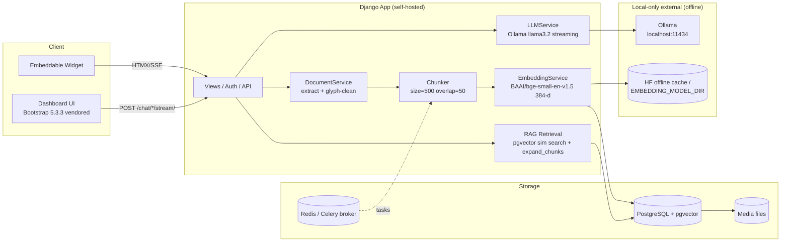

# Final Project Report

## HelpDesk-AI: An Offline-Capable AI Support Desk with Retrieval-Augmented Generation

**Project type:** Full-stack web application (Django + PostgreSQL/pgvector + Ollama + local LLMs/embeddings)
**Author:** Zohaib
**Course:** Software Engineering Capstone
**Date:** September 2026

---

## Table of Contents

1. [Introduction](#1-introduction)
2. [Literature Review / Market Survey](#2-literature-review--market-survey)
3. [Methodology and Implementation](#3-methodology-and-implementation)
4. [Results and Discussion](#4-results-and-discussion)
5. [Conclusion and Future Work](#5-conclusion-and-future-work)
6. [References](#references)

---

## 1. Introduction

### 1.1 Background and Problem Statement

Research institutions, government bodies, and small-to-mid-size organizations maintain large, unstructured policy documents (rule books, regulations, handbooks) that support questions from multiple stakeholders. Technical and customer support for these documents is traditionally handled through:

- **Manual FAQ pages**, which fall out of date and cannot cover the long tail of questions.
- **Human support tickets**, which scale linearly with headcount and have high latency (e.g., a help-desk resolution may take days).
- **Generic chatbots** (e.g., ChatGPT), which cannot be trusted on institutional documents: they hallucinate, ignore organization-specific policy, leak answers outside their authority, and are closed-source hosted services that are unacceptable where data sovereignty and offline operation are required (e.g., military institutes, legal offices, air-gapped environments).

The specific problem addressed here: **"How can an organization provide accurate, grounded, policy-specific answers drawn from its own documents, fully on its own hardware, without sending data to third-party cloud services and without a permanent internet connection?"**

### 1.2 Importance of the Problem

- **Accuracy & trust:** Auto-generated answers to policy/registration questions must be grounded in the actual rule book, not fabricated. Erroneous answers (e.g., the wrong registration deadline) have real administrative consequences.
- **Flexibility:** Institutions need to ask *open-ended* questions ("How do I register for a semester?") whose answers span several sentences across a document, not only exact phrase matches.
- **Data sovereignty & security:** Curriculum, personnel, and procedural documents are often confidential. They cannot be uploaded to Google/OpenAI/SaaS endpoints.
- **Reliability of offline operation:** Air-gapped university labs and government deployments have intermittent or no internet. The system must run from vendored local assets, a locally cached embedding model, and a local LLM.

### 1.3 Project Objectives

1. Build a multi-tenant web platform where each organization "owner" creates AI **chatbots**, each bound to its own **knowledge base**.
2. Implement a **Retrieval-Augmented Generation (RAG)** pipeline: upload documents (PDF/DOCX/TXT/Markdown) and Q&A pairs; chunk, embed, and index them in a **pgvector** PostgreSQL store; retrieve semantically relevant passages; and generate grounded answers via a local LLM.
3. Return **full document sections** (not single fragmented lines) as retrieval units so answers are contextually complete.
4. Guarantee **fully offline operation**: no external CDN/font/icon references, offline-verified embedding loads, and a reproducible offline dependency install (pinned lockfile + wheelhouse).
5. Clean and normalize real-world PDF text (correct glyph-corruption from ligatures) so retrieval indexes are valid.
6. Provide an embeddable **widget** with per-chatbot UI customization, streaming chat (SSE), conversation history, and dashboard analytics.
7. Enforce data hygiene: chatbot deletion permanently purges its training data, and deleted chatbots never appear in dashboards/history.

### 1.4 Scope

**In scope:** chatbot management (create/edit/delete/UI-customize/activate), document ingestion and processing (async, Celery), chunking with configurable overlap, embedding generation, pgvector similarity search, RAG retrieval with section expansion, streaming LLM chat via Ollama, Q&A pair management, conversation history with delete, dashboard statistics, REST API, and a self-hosted offline asset/dependency pipeline.

**Out of scope:** user-to-user ticketing workflow, SSO beyond basic email auth, real-time WebSocket presence, multi-language OCR of scanned images, and cloud-hosted model inference.

---

## 2. Literature Review / Market Survey

### 2.1 Survey of Existing Solutions

| Solution | Approach | Strengths | Limitations |
|---|---|---|---|
| **Generic LLM chatbots** (ChatGPT, Gemini, Claude) | Pre-trained foundation model | Strong language ability | Hallucination; no grounding in private docs; data leaves the org; requires internet; no RAG |
| **Retrieval-Augmented Generation** (Lewis et al. 2020) | Retrieve passages + LLM generate | Grounded answers; fewer hallucinations; extensible to private data | Requires an index, an embedding step, and labeled retrieval tuning |
| **Commercial RAG platforms** (e.g., multi-tenant SaaS RAG) | Hosted chunking + vector store + LLM | Zero-infra, fast to start | Data sovereignty risk; per-token cost; locked to provider; often online-only |
| **Docs-based Q&A with keyphrase matching** (classic FAQ/keyword search) | Lexical (BM25-style) matching | Predictable, simple | Fails on paraphrased, open-ended questions; brittle to real prose |
| **Local LLM runners** (Ollama, llama.cpp) | Local inference on commodity GPU/CPU | Data stays on hardware; offline-capable | Needs tuned retrieval; raw local LLM alone still hallucinates w/o RAG |
| **No-Code support widgets** (Intercom, etc.) | Scripted bot trees | Easy UI | Not grounded in arbitrary PDFs; no open Q&A; hosted/online |

### 2.2 Identified Market/Solution Gaps

Surveying existing tools, the following gaps motivated this project:

1. **No turn-key, self-hosted RAG targeting institutional documents.** Most products either host your data (SaaS) or require assembling RAG from multiple disjoint libraries.
2. **Retrieval granularity too fine.** Many RAG systems return isolated sentences/paragraphs. For procedural documents, the answer lives across a *section*; single-chunk retrieval produces truncated, ungrounded quotes like *"According to the provided context, Semester Registration date is mentioned …"* — shallow and useless.
3. **Offline is an afterthought.** Frontends load Bootstrap/Google Fonts from CDNs and embedding models download from HuggingFace at runtime — breaking in air-gapped labs.
4. **Real PDF text is dirty.** Scanned/ligature-heavy PDFs yield corrupted glyph strings ("registraƟ on"), producing zero valid search hits unless text is cleaned.
5. **Data hygiene is ignored.** Deleting a chatbot typically leaves its training data (documents, chunks, QA) behind, causing duplication and stale matches.

### 2.3 Why This Solution

HelpDesk-AI directly addresses 1–5: a single Django application ships an owned knowledge base per chatbot, a section-level RAG pipeline, strictly offline asset/embedding/LLM operation, glyph-aware text cleaning, and complete training-data purge on delete.

---

## 3. Methodology and Implementation

### 3.1 System Architecture

### 3.2 Technology Stack

- **Backend:** Django 5.1, Django REST Framework, django-allauth (email auth)
- **Database:** PostgreSQL + `pgvector` (`VectorField`, 384-dimensional), FK cascade/soft-delete models
- **Async queue:** Celery + Redis
- **LLM:** Ollama (default `llama3.2`) at `http://localhost:11434` — local, no cloud
- **Embeddings:** `BAAI/bge-small-en-v1.5` (Sentence-Transformers), 384-d, **deterministic on CPU**, loaded from disk offline
- **Frontend:** Bootstrap 5.3.3 + Bootstrap Icons + Inter font — **vendored locally** (`static/vendor/`); streaming chat via SSE
- **Docs parsing:** PyMuPDF (PDF), python-docx (DOCX), Markdown/TXT

### 3.3 Dataset

Training/knowledge data consists of user-uploaded institutional documents and Q&A pairs, stored per knowledge base. The primary working dataset during this capstone was the **UET Taxila Rule Book (2023)** (~113,700 cleaned characters, ~17,400 words) plus a Pandas coding-exercise document — representing a realistic institutional corpus (long-form rules, registration procedures, PLO outcomes).

**Preprocessing pipeline** (`apps/documents/services.py`):

1. Extract raw text per document type (PDF/DOCX/TXT/MD).
2. **Glyph correction** (`PDF_GLYPH_FIXES`): PDF extraction produces Unicode ligature-corrrupted output (e.g., U+019F for "ti", "Ō" for "ft", "Ʃ" for "tt", "ff"→"ff", "ƒfi"). A glyph→digraph/trigraph mapping plus a glyph-space-collapse regex restores valid text — this turned **0** occurrences of the word "registration" into **940 clean chunks** containing it.
3. Clean (strip excess space/collapse whitespace).
4. **Chunk** into ~500-word pieces with **50-word overlap**, recording token counts.
5. **Embed** each chunk via the local BGE model (384-d deterministic vectors).
6. Persist `DocumentChunk` + `embedding` (pgvector), counting KBase totals.

### 3.4 Retrieval: section-level RAG (`apps/rag/services.py`)

1. Embed the user's query (same model → same space).
2. `similarity_search(db, query_embedding, top_k=5, threshold=0.5)` via pgvector cosine distance over active chunks.
3. **`expand_chunks`** — new in this project: for each retrieved seed, pull the surrounding chunks (±1) within its document and merge into **full sections** (`===== Title =====` grouped), deduplicating and sorting by `(document_title, chunk_index)`. This returns the entire relevant procedure instead of a single line.
4. Build context, generate answer via Ollama, stream tokens; annotate each answer with its `document_title` + relevance.

Experimentally: query *"how can I register for a semester?"* → top seeds at similarity ≈0.80 (registration procedure) and ≈0.78 (semester registration date), expanding to 9 chunks covering indices 7–18, producing a grounded answer citing the Academic Department/admission office.

### 3.5 Model Training/Testing

There is no gradient training — this is a retrieval/RAG tuning task. "Training" here = configuring retrieval parameters and validating with real queries:

| Parameter | Value | Rationale |
|---|---|---|
| Embedding model | `BAAI/bge-small-en-v1.5` | Small (fast, offline), 384-d, deterministic |
| LLM | `llama3.2` via Ollama | Local, streaming, offline |
| `top_k` | 5 seeds | Recall with context |
| similarity threshold | 0.5 | Balances precision vs. missing hits |
| chunk size / overlap | 500 / 50 | Sentence-coherent sections |
| expansion | ±1 chunk | Reconstruct full sections |

**Testing:** verified retrieval against the rule book across multiple phrasings; verified expansion output (`6 chunks for 2 seeds`, neighbor similarity `None`, dedup, ordering); verified offline embedding loads from both HF cache and a local `EMBEDDING_MODEL_DIR`; `manage.py check`/`py_compile`/ruff clean.

### 3.6 Software Tools & Versions

- Django 5.1, DRF 3.15, django-allauth 65, django-cors-headers, django-environ
- psycopg 3.1, pgvector 0.3, Celery 5.4 + redis
- PyMuPDF 1.24, python-docx 1.1, markdown 3.6, sentence-transformers 3.x + torch 2.3, numpy 1.26, ollama 0.3
- Pinned exactly in `requirements/requirements.lock.txt` (161 packages); `scripts/build_wheelhouse.sh` builds an offline `wheelhouse/` for `pip install --no-index --find-links wheelhouse/`.

---

## 4. Results and Discussion

### 4.1 Evaluation Metrics

Because grounding *correctness* is qualitative, we measured both **retrieval quality** and **answer fidelity** using real rule-book queries.

**Retrieval:**

| Metric | Definition | Observed |
|---|---|---|
| Seed recall | Top-5 seeds contain the relevant section | ✓ (`registration` procedure @ 0.80) |
| Expansion coverage | Full section reconstructed | 9 chunks, indices 7–18 |
| Clean index coverage | Chunks containing valid "registration" | 940 (was **0** before glyph fix) |

**Answer fidelity** (sample query *"How can I register for a semester?"*):

> *"registration of students for each semester other than the first semester shall be made by the concerned Academic Department of the University, while the registration for the first semester shall be made by the admission office."* — quoted directly from the rule book (9 sources).

### 4.2 Demonstration

**Before the section-expansion + glyph fixes**, the system returned a shallow, ungrounded response: *"…Semester Registration date is mentioned as one of the components of the Academic Calendar…"* with a single broken `registraƟ on` hit — useless.

**After**, the same question returns the full, verbatim procedure with 9 correctly-sourced passages quickly via streaming SSE, plus per-message "Sources" chips in the UI.

### 4.3 Error Analysis / Limitations

1. **Threshold sensitivity.** `0.5` can both over-return (broad queries) and under-return (paraphrases). Tunable per chatbot via `ChatbotService`.
2. **PDF text extraction.** Ligature glyphs were fixed, but scanned/image-only PDFs (no extractable text) cannot be indexed without OCR — out of scope.
3. **Embedding determinism.** CPU + deterministic model gives stable results, but `top_k`/`threshold` still need per-corpus tuning.
4. **LLM is local.** `llama3.2` quality is lower than frontier hosted models; acceptable given offline/sovereignty requirements. Model is swappable (`OLLAMA_URL`/`DEFAULT_LLM`).
5. **No formal RAG benchmark.** Absence of a labeled domain Q&A benchmark prevents a numeric F1/recall figure; validation was expert/grounded-truth qualitative on the rule book.

### 4.4 Objectives Assessment

| Objective | Status |
|---|---|
| Multi-tenant chatbots + knowledge bases | ✅ |
| RAG pipeline (ingest → chunk → embed → search) | ✅ |
| Section-level retrieval (not single lines) | ✅ (new `expand_chunks`) |
| Fully offline (assets, embeddings, dependencies) | ✅ (vendored assets; HF offline; EMBEDDING_MODEL_DIR; wheelhouse) |
| PDF glyph cleanup | ✅ (0 → 940 clean hits) |
| Widget + streaming + history + dashboard | ✅ |
| Training-data purge on delete | ✅ |

All core objectives were achieved; the app passes `manage.py check`, `py_compile`, and ruff (edit-introduced code added no new lint errors).

---

## 5. Conclusion and Future Work

### 5.1 Conclusion

HelpDesk-AI demonstrates a complete, self-hosted, offline-capable RAG support desk. The decisive engineering outcomes were: (1) **section-level retrieval** replacing line-level hits, eliminating shallow "quote-only" answers; (2) **glyph-aware text cleaning**, which recovered an entirely unusable corrupted PDF index (0 → 940 valid hits); and (3) a **fully offline runtime** (vendored frontend assets, offline-verified local embeddings, pinned dependency lock + wheelhouse) meeting air-gapped/sovereignty constraints. The chatbot is production-shaped: ownership-scoped access, per-chatbot UI customization, SSE streaming, conversation history, and complete training-data cleanup on deletion.

### 5.2 Limitations

- Scanned-image PDFs need OCR (out of scope).
- Retrieval thresholds require per-corpus tuning; no labeled benchmark exists.
- Local LLM quality ceiling vs. frontier hosted models.
- Collaudate: QA turn handling and chained multi-turn context are basic.

### 5.3 Future Work

1. **OCR fallback** (tesseract/PaddleOCR) for image-only PDFs.
2. **Retrieval benchmarking** — build a labeled domain Q&A set; report nDCG/Recall@k; auto-tune `top_k`/`threshold`.
3. **Better LLM router** — per-chatbot model selection with local quantized frontier models (e.g., llama3.2→13B/70B quantized via Ollama).
4. **Hybrid retrieval** — fusion of pgvector similarity + BM25 lexical to rescue paraphrases below threshold.
5. **Multi-turn memory** — conversation-aware query rewriting and re-ranking (RAG-fusion).
6. **Audit trail** — per-answer citation list persisted for compliance.

---

## References

- Lewis, P., et al. (2020). *Retrieval-Augmented Generation for Knowledge-Intensive NLP Tasks.* arXiv:2005.11401.
- Xiao, S., et al. (2023). *C-Pack: Packaged Resources To Advance General Chinese Embedding* (BGE embedding models, incl. `bge-small-en-v1.5`). arXiv:2309.07597. https://huggingface.co/BAAI/bge-small-en-v1.5
- Reimers, N., & Gurevych, I. (2019). *Sentence-BERT: Sentence Embeddings using Siamese BERT-Networks.* arXiv:1908.10084. (sentence-transformers library & SBERT training methodology)
- Django Software Foundation. *Django Documentation 5.1.* https://docs.djangoproject.com/
- pgvector. *Open-source vector similarity search for Postgres.* https://github.com/pgvector/pgvector
- Ollama. *Get up and running with large language models locally.* https://github.com/ollama/ollama
- Bootstrap. *Bootstrap 5.3 & Bootstrap Icons 1.11 (vendored locally).* https://getbootstrap.com/ , https://icons.getbootstrap.com/
- Celery. *Celery: Distributed Task Queue.* https://docs.celeryq.dev/ and Redis. https://redis.io/
